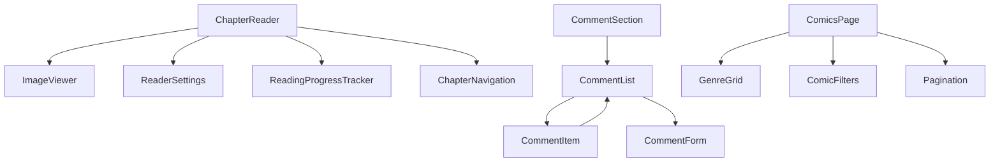

# Plan: Complete ComicWise Feature Implementation (REVISED)

**TL;DR:** Implement advanced chapter reader with hybrid sync (settings→DB, zoom→local), threaded comments, smart progress tracking (nav + 30s fallback), enhance /comics instead of creating browse page. Skip redundant pages, focus on core UX. Soft-delete accounts for data retention.

**Key Decisions Applied:**

- ✅ Hybrid reader sync: Background/mode sync via DB, zoom stays local
- ✅ Threaded comment system (nested replies)
- ✅ Soft delete accounts (archive approach)
- ✅ Skip browse page → enhance existing /comics with genre cards
- ✅ Progress saves on navigation + 30s fallback
- ✅ Ratings are updatable (one per user)
- ✅ Image quality is visual hint only
- ✅ Mobile defaults to vertical scroll

---

## **Steps**

### **Phase 1: Chapter Reader Enhancement (CRITICAL)**

**1. Create ReaderSettings Schema & DB Table**

- Schema: `src/schemas/reader-settings.schema.ts`
  - Fields: `userId`, `backgroundMode` (white/dark/sepia), `readingMode` (vertical/horizontal), `defaultQuality` (low/medium/high)
- **Decision Applied:** Zoom level stays in localStorage (device-specific), other settings in DB
- Migration: Add `reader_settings` table to `src/database/schema.ts`
- Queries: `getUserReaderSettings`, `updateReaderSettings` in DAL

**2. Build Advanced ImageViewer Component**

- File: `src/components/comics/ImageViewer.tsx`
  - Zoom state in local hook (50%-200%)
  - Pan with drag (when zoomed)
  - Pinch-to-zoom on mobile
  - Fit-to-width/fit-to-height buttons
  - **Decision Applied:** No quality affecting ImageKit params, visual only
- Use `react-zoom-pan-pinch` or custom implementation
- Keyboard: +/- for zoom, 0 to reset

**3. Enhance ChapterReader with Dual Reading Modes**

- File: `src/components/comics/ChapterReader.tsx`
  - **Vertical mode:** Infinite scroll with Intersection Observer for lazy load
  - **Horizontal mode:** One image at a time, swipeable (Embla Carousel or custom)
  - **Decision Applied:** Detect mobile (useMediaQuery), default to vertical on <768px
  - Preload next/previous 2 images in both modes
  - Mode toggle in header with DB sync

**4. Create ReaderSettings Panel Component**

- File: `src/components/comics/ReaderSettings.tsx`
  - Sheet/drawer from right (shadcn Sheet component)
  - Background selector (white/dark/sepia with previews)
  - Mode selector (vertical/horizontal with icons)
  - Quality dropdown (low/med/high - visual hint for future)
  - Save button → calls `updateReaderSettingsAction`
- **Decision Applied:** Sync to DB on save, apply immediately to reader

**5. Implement Comprehensive Keyboard Navigation**

- Add to `src/components/comics/ChapterReader.tsx`:
  - Arrow Left/Right: Previous/Next image (horizontal) or chapter
  - Arrow Up/Down: Scroll or Previous/Next image (configurable)
  - Space/Shift+Space: Page down/up
  - F: Toggle full-screen
  - S: Open settings panel
  - ESC: Close settings/Exit full-screen
  - Home/End: First/Last image
  - 1-9: Jump to 10%-90% of chapter
- Prevent when input focused, add help overlay (press ? to show shortcuts)

**6. Implement Full-Screen Mode**

- Use Fullscreen API in `src/components/comics/ChapterReader.tsx`
- Auto-hide UI after 3s idle in full-screen
- Show on mousemove/tap
- Exit with ESC or F key
- Mobile: Request screen.orientation.lock to landscape

**7. Integrate Smart Reading Progress Tracking**

- File: `src/components/comics/ReadingProgressTracker.tsx`
  - **Decision Applied:** Save on: chapter nav, image change (horizontal mode), 30s interval (vertical mode)
  - Track: `currentImageIndex`, `scrollPercentage`, `lastReadAt`
  - Debounce saves (prevent spam to DB)
  - Visual progress bar at top (thin line)
  - "Resume from page X" dialog on chapter load if progress exists
- Action: `src/lib/actions/reading-progress.actions.ts`
- Extend schema to include `currentImageIndex` field

**8. Add Touch Gesture Support (Mobile)**

- Horizontal mode: Swipe left/right for next/prev (use Embla or `react-swipeable`)
- Vertical mode: Pull-to-refresh disabled (prevent conflicts)
- Pinch-to-zoom in `src/components/comics/ImageViewer.tsx`
- Double-tap to zoom to fit

---

### **Phase 2: Enhanced Comics Page (Replaces Browse Page)**

**9. Add Genre Discovery Section to Comics Page**

- Update `src/app/(root)/comics/page.tsx`:
  - Add "Browse by Genre" section above filters (when no filters active)
  - Grid of genre cards (6-8 popular genres)
  - Each card: name, icon, comic count, link to filtered view
- Component: `src/components/comics/GenreGrid.tsx`
- On click: Navigate to `/comics?genre=action` (filter applied)
- **Decision Applied:** No separate browse page needed

**10. Implement Genre Filter Integration**

- Update `src/components/comics/comic-filters.tsx`:
  - Add genre multi-select (shadcn Checkbox group or Combobox)
  - Load from `getAllGenres` query
  - Update searchParams on change
- Update `src/app/(root)/comics/page.tsx`:
  - Read `genres` param (comma-separated IDs)
  - Pass to query (backend already supports `genreIds` filter)

**11. Add Pagination Controls**

- Update `src/app/(root)/comics/page.tsx`:
  - Use shadcn `src/components/ui/pagination.tsx` component
  - Show "Showing X-Y of Z comics"
  - Page buttons: First, Prev, 1...N, Next, Last
  - Items per page: 20/40/60 dropdown (update searchParams)
  - Position: Above and below comic grid

---

### **Phase 3: Genre Pages**

**12. Create Genre Detail Pages**

- File: `src/app/(root)/genres/[slug]/page.tsx`
  - Fetch genre with `getGenreBySlug`
  - Hero section: Genre name, description, banner image
  - Comics grid (filtered by genre)
  - Reuse `src/components/comics/comic-list.tsx` component
  - Related genres sidebar (genres frequently paired)
- Metadata for SEO (generateMetadata)

---

### **Phase 4: Profile Pages Polish**

**13. Fix Change Password Page**

- Replace `src/app/(root)/profile/change-password/page.tsx`:
  - Extract to component: `src/components/profile/ChangePasswordForm.tsx`
  - Use existing `/api/profile/change-password` endpoint
  - Add password strength indicator (use `zxcvbn-ts` library)
  - Validation: Current must match, new ≥8 chars, confirmation matches
  - Toast on success, clear form, optional redirect

**14. Implement Settings Page**

- Update `src/app/(root)/profile/settings/page.tsx`:
  - **Section 1: Notifications** (checkboxes for email preferences)
  - **Section 2: Privacy** (profile visibility toggle, reading history visibility)
  - **Section 3: Danger Zone** (delete account button with confirmation dialog)
  - **Decision Applied:** Soft delete via `deleteAccountAction`
- Schema: `src/schemas/settings.schema.ts`
- Action: `src/lib/actions/profile.actions.ts` → `updateSettingsAction`, `deleteAccountAction`
- Backend: Add `deletedAt`, `settings` JSONB column to `user` table
- Mutation: Add `softDeleteUser` to `src/database/mutations/user-mutations.ts`

**15. Centralize Profile Actions**

- Create `src/lib/actions/profile.actions.ts`:
  - `updateProfileAction` (migrate from API route)
  - `changePasswordAction` (wrap existing API)
  - `updateSettingsAction` (new)
  - `deleteAccountAction` (new - soft delete, null all PII, set deletedAt)
- **Decision Applied:** Soft delete sets `deletedAt`, anonymizes data (email→null, name→"Deleted User")
- Update profile pages to use actions instead of API routes

---

### **Phase 5: Rating & Comment System**

**16. Create Updatable Rating Component**

- File: `src/components/comics/RatingComponent.tsx`
  - Display: Star rating (read-only) with average and count
  - Interactive: Click to rate (1-5 stars) on comic detail page
  - **Decision Applied:** Check existing rating, allow update via PUT
  - Optimistic UI update
  - Toast: "Rating updated" vs "Thanks for rating"
- Schema: `src/schemas/rating.schema.ts` (1-5 validation)
- Action: `src/lib/actions/rating.actions.ts` → `upsertRatingAction`
- Mutation: Use `src/database/mutations/rating-mutations.ts`, add `upsertRating`
- Update `src/components/comics/comic-card.tsx` to show average rating

**17. Build Threaded Comment System**

- **Decision Applied:** Nested replies with parent-child relationship
- Files:
  - `src/components/comics/CommentSection.tsx` - Container
  - `src/components/comics/CommentList.tsx` - Recursive list
  - `src/components/comics/CommentItem.tsx` - Individual comment with reply button
  - `src/components/comics/CommentForm.tsx` - Add/edit form
- Features:
  - Display comments with avatars, usernames, timestamps
  - Reply button → inline reply form (sets `parentId`)
  - Edit/delete own comments (with confirmation)
  - Pagination (10 top-level per page, show all replies)
  - Sort: Newest, Oldest, Most Replies
- Schema: `src/schemas/comment.schema.ts` - add `parentId` field
- Actions: `src/lib/actions/comment.actions.ts`
  - `addCommentAction`, `editCommentAction`, `deleteCommentAction` (soft delete)
- Mutations: Update `src/database/mutations/comment-mutations.ts` to support `parentId`
- Backend: Modify `comment` schema to include `parentId` foreign key
- Add to `src/app/(root)/comics/[slug]/page.tsx` below chapters

---

### **Phase 6: Code Quality & Testing**

**18. Technical Debt Cleanup**

- Profile: Remove duplicate API route logic after migrating to actions
- Reader: Replace `any` types with proper interfaces
- Auth forms: Resolve 3 TODO comments (integrate server actions)
- Remove unused `eslint-disable` comments
- Add JSDoc to all server actions (params, returns, errors)

**19. Comprehensive Testing**

- **Unit tests:**
  - `tests/unit/actions/profile.actions.test.ts`
  - `tests/unit/actions/reading-progress.actions.test.ts`
  - `tests/unit/actions/rating.actions.test.ts`
  - `tests/unit/actions/comment.actions.test.ts`
- **E2E tests:**
  - `tests/e2e/chapter-reader.spec.ts` (modes, keyboard, progress save/resume)
  - `tests/e2e/genre-navigation.spec.ts` (genre cards, filtering, pages)
  - `tests/e2e/profile-settings.spec.ts` (password change, settings, soft delete)
  - `tests/e2e/rating-comments.spec.ts` (rate, update rating, add comment, reply, edit, delete)
- Target: Maintain 80%+ coverage

**20. Documentation Updates**

- Update `.github/prompts/features.prompt.md` with actual status and removed browse page
- Create `docs/reader-guide.md` (user guide for reader features)
- Update `README.md` feature list
- Add reader keyboard shortcuts to help overlay
- Update `memory-bank/progress.md` with completion status

---

## **Verification**

### **Automated:**

```bash
pnpm type-check     # Must pass
pnpm lint           # Must pass
pnpm test:unit:run  # All tests pass
pnpm test:e2e       # All tests pass
pnpm build          # Production build succeeds
```

### **Manual Testing Checklist:**

- [ ] **Reader:** Test vertical/horizontal modes, zoom (50-200%), pan, keyboard nav (all shortcuts), full-screen, settings sync
- [ ] **Progress:** Read 3 pages, close tab, reopen → should resume from page 3
- [ ] **Mobile reader:** Test swipe, pinch-zoom, default vertical mode, auto-hide controls
- [ ] **Comics page:** Genre cards visible, clicking filters correctly, pagination works (all controls)
- [ ] **Genre pages:** Load genre, show description, filter comics, related genres appear
- [ ] **Password change:** Old password validation, strength indicator, success flow
- [ ] **Settings:** Toggle all options, save, reload page → settings persist
- [ ] **Account deletion:** Trigger soft delete, verify user marked deleted, data anonymized
- [ ] **Rating:** Rate comic (1-5 stars), update rating, verify average recalculates
- [ ] **Comments:** Add comment, reply to comment, edit own comment, delete comment (soft), verify nesting 3+ levels

### **Performance Targets:**

- [ ] Reader initial load: <2s on 3G
- [ ] Image lazy loading works (only visible +2 preload)
- [ ] Lighthouse: 90+ (Performance, A11y, Best Practices, SEO)
- [ ] No console errors
- [ ] Settings save <500ms
- [ ] Progress tracking doesn't block reading (async)

---

## **Technical Specifications**

### **Database Schema Changes:**

```typescript
// Add to schema.ts
export const readerSettings = pgTable("reader_settings", {
  id: serial("id").primaryKey(),
  userId: integer("user_id")
    .notNull()
    .references(() => user.id, { onDelete: "cascade" }),
  backgroundMode: varchar("background_mode", 16).default("white"), // white|dark|sepia
  readingMode: varchar("reading_mode", 16).default("vertical"), // vertical|horizontal
  defaultQuality: varchar("default_quality", 16).default("medium"), // low|medium|high
  createdAt: timestamp("created_at").defaultNow(),
  updatedAt: timestamp("updated_at").defaultNow(),
});

// Modify user table
export const user = pgTable("user", {
  // ... existing fields
  settings: jsonb("settings"), // {emailNotifications: bool, profileVisibility: 'public'|'private', readingHistoryVisibility: bool}
  deletedAt: timestamp("deleted_at"), // null = active, timestamp = soft deleted
});

// Modify comment table
export const comment = pgTable("comment", {
  // ... existing fields
  parentId: integer("parent_id").references((): AnyPgColumn => comment.id, { onDelete: "cascade" }), // null = top-level
});

// Modify readingProgress table
export const readingProgress = pgTable("reading_progress", {
  // ... existing fields
  currentImageIndex: integer("current_image_index").default(0), // for horizontal mode
  scrollPercentage: integer("scroll_percentage").default(0), // for vertical mode
});
```

### **New Actions Summary:**

| Action                       | File                          | Schema                 | Purpose                 |
| ---------------------------- | ----------------------------- | ---------------------- | ----------------------- |
| `updateReaderSettingsAction` | `reading-progress.actions.ts` | `ReaderSettingsSchema` | Sync reader preferences |
| `upsertRatingAction`         | `rating.actions.ts`           | `RatingSchema`         | Add or update rating    |
| `addCommentAction`           | `comment.actions.ts`          | `CommentSchema`        | Add comment or reply    |
| `editCommentAction`          | `comment.actions.ts`          | `CommentSchema`        | Edit own comment        |
| `deleteCommentAction`        | `comment.actions.ts`          | -                      | Soft delete comment     |
| `updateSettingsAction`       | `profile.actions.ts`          | `SettingsSchema`       | Update user settings    |
| `deleteAccountAction`        | `profile.actions.ts`          | -                      | Soft delete account     |

### **Component Dependencies:**



---

## **Revised Decisions**

### **Browse Page Elimination**

**Decision:** Skip dedicated browse page, enhance /comics instead
**Implementation:** Add genre card grid to comics page (when no filters active), make genre filter prominent
**Impact:** Saves ~8 hours dev time, reduces route complexity, maintains discovery UX

### **Reader Settings Hybrid Sync**

**Decision:** Background/mode sync to DB, zoom stays localStorage
**Rationale:** User expects consistent theme/mode across devices, but zoom is device/context-dependent (desktop users zoom out, mobile users zoom in)
**Implementation:** Split settings into `reader_settings` table (synced) and `localStorage` (local)

### **Smart Progress Tracking**

**Decision:** Save on navigation + 30s fallback
**Rationale:** Balance UX (don't lose progress) with DB load (not every scroll)
**Implementation:** useEffect with interval (30s) + explicit saves on page/chapter changes

### **Threaded Comments**

**Decision:** Full nesting with parent-child relationship
**Rationale:** Better discussions, worth the complexity, future-proof for community features
**Implementation:** Recursive React components, self-referencing foreign key, soft delete preserves thread structure

---

**This plan is now ready for implementation.** All ambiguities resolved, technical decisions made, and scope defined.
